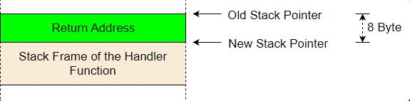
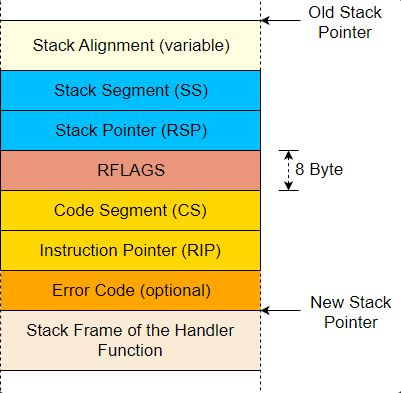

# CPU Exceptions
Notes taken from [blog post](https://os.phil-opp.com/cpu-exceptions/)
## Overview
- Exception signals that something is wrong with the current instruction
- Most important x86 exceptions:
    - **Page fault**: illegaly memory accesses
    - **Invalid Opcode**: occurs when the current instruction is invalid
    - **General Protection Fault**: used for a broad amount of causes
    - **Double Fault**: This happens when the interrupt handler fails
    - **Triple Fault**: This happens when the interrupt handler handling the failure of the original interrupt handler fails
### The Interrupt Descriptor Table
- We use an Interrupt Descriptor Table (IDT) to specify a handler function for each exception
- Each entry must have the following 16-byte structure
<table>
  <tr>
    <th>Type</th>
    <th>Name</th>
    <th>Description</th>
  </tr>
  <tr>
    <td>u16</td>
    <td>Function Pointer [0:15]</td>
    <td>The lower bits of the pointer to the handler function</td>
  </tr>
  <tr>
    <td>u16</td>
    <td>GDT Selector</td>
    <td>Selector of a code segment in the <a href="https://en.wikipedia.org/wiki/Global_Descriptor_Table">global descriptor table</a></td>
  </tr>
  <tr>
    <td>u16</td>
    <td>Options</td>
    <td>(Shown in the table below)</td>
  </tr>
  <tr>
    <td>u16</td>
    <td>Function Pointer [16:31]</td>
    <td>The middle bits of the pointer to the handler function</td>
  </tr>
  <tr>
    <td>u32</td>
    <td>Function Pointer [32:63]</td>
    <td>The reamining bits of the pointer to the handler function</td>
  </tr>
  <tr>
    <td>u32</td>
    <td>Reserved</td>
    <td></td>
  </tr>
</table>

- Options field has the following format:
<table>
  <tr>
    <th>Bits</th>
    <th>Name</th>
    <th>Description</th>
  </tr>
  <tr>
    <td>0-2</td>
    <td>Interrupt Stack Table Index</td>
    <td>0: Don’t switch stacks, 1-7: Switch to the n-th stack in the Interrupt Stack Table when this handler is called.</td>
  </tr>
  <tr>
    <td>3-7</td>
    <td>Reserved</td>
    <td></td>
  </tr>
  <tr>
    <td>8</td>
    <td>0: Interrupt Gate, 1: Trap Gate	</td>
    <td>If this bit is 0, interrupts are disabled when this handler is called.</td>
  </tr>
  <tr>
    <td>9-11</td>
    <td>Must be 1</td>
    <td></td>
  </tr>
  <tr>
    <td>12</td>
    <td>Must be 0</td>
    <td></td>
  </tr>
  <tr>
    <td>13-14</td>
    <td>Descriptor Privilege Level (DPL)</td>
    <td>The minimal privilege level required for calling this handler.</td>
  </tr>
  <tr>
    <td>15</td>
    <td>Present</td>
    <td></td>
  </tr>
</table>

- Each exception has a predefined IDT index
- The [Exception Table](https://wiki.osdev.org/Exceptions) in OSDev wiki
- The CPU roughly does the following in the event of an exception:
    1. Push registers to stack, including EIP/RIP and the [RFLAGS](https://en.wikipedia.org/wiki/FLAGS_register) register
    2. Read corresponding entry from IDT
    3. Check if entry is present, if not then raise double fault
    4. Disable hardware interrupts if the entry is an interrupt gate
    5. Load the specified GDT selector into the CS
    6. Jump to the specified handler function
## An IDT Type
- We can use the `InterruptDescriptorTable` struct from the `x86_64` crate
- Looks like this:
```rust
#[repr(C)]
pub struct InterruptDescriptorTable {
    pub divide_by_zero: Entry<HandlerFunc>,
    pub debug: Entry<HandlerFunc>,
    pub non_maskable_interrupt: Entry<HandlerFunc>,
    pub breakpoint: Entry<HandlerFunc>,
    pub overflow: Entry<HandlerFunc>,
    pub bound_range_exceeded: Entry<HandlerFunc>,
    pub invalid_opcode: Entry<HandlerFunc>,
    pub device_not_available: Entry<HandlerFunc>,
    pub double_fault: Entry<HandlerFuncWithErrCode>,
    pub invalid_tss: Entry<HandlerFuncWithErrCode>,
    pub segment_not_present: Entry<HandlerFuncWithErrCode>,
    pub stack_segment_fault: Entry<HandlerFuncWithErrCode>,
    pub general_protection_fault: Entry<HandlerFuncWithErrCode>,
    pub page_fault: Entry<PageFaultHandlerFunc>,
    pub x87_floating_point: Entry<HandlerFunc>,
    pub alignment_check: Entry<HandlerFuncWithErrCode>,
    pub machine_check: Entry<HandlerFunc>,
    pub simd_floating_point: Entry<HandlerFunc>,
    pub virtualization: Entry<HandlerFunc>,
    pub security_exception: Entry<HandlerFuncWithErrCode>,
    // some fields omitted
}
```
- Fields have type `idt::Entry<F>`, struct that represents the fields of an IDT entry
- Type parameter `F` defines the expected handler function type
- Some entries require a `HandlerFunc` and others `HandlerFuncWithErrCode`
- `HandlerFunc` type:
```rust 
type HandlerFunc = extern "x86-interrupt" fn(_: InterruptStackFrame);
```
- Type alias for an `extern "x86-interrupt" fn` type
- `extern` keyword defines a function with a foreign calling convention
## The Interrupt Calling Convention
- Similar to function calls, but has to be able to happen at any instruction, not just the `call` instruction like a function call
- Rules for C functions (specified in System V ABI):
	- the first six integer arguments are passed in registers `rdi`, `rsi`, `rdx`, `rcx`, `r8`, `r9`
	- additional arguments are passed on the stack
	- results are returned in rax and rdx
- Rust does not follow the C ABI, so we need to use `extern "C" fn` for function declaration
### Preserved and Scratch Registers
- Registers are separated into *preserved* and *scratch*
#### Preserved Registers
- Values of preserved registers must remaain unchanged across function calls
- "*Callee-saved*"
- Common to save these registers to the stack at function's beginning and restore them before returning
#### Scratch Registers
- Allowed to overwrite scratch registers without restrictions
- "*Caller-saved*"
- Caller needs to backup and restore these registers if they want to preserve their values
---
- C calling convetions defines the following registers on x86_64:
<table>
	<tr>
		<th>preserved registers</th>
		<th>scratch registers</th>
	</tr>
	<tr>
		<td>rbp, rbx, rsp, r12, r13, r14, r15</td>
		<td>rax, rcx, rdx, rsi, rdi, r8, r9, r10, r11</td>
	</tr>
	<tr>
		<td>callee-saved</td>
		<td>caller-saved</td>
	</tr>
</table>

- The compiler knows these rules, so it generates the code accordingly
### Preserving All Registers
- Need to perserve all registers since we don't know when the handler function is called
- Meaning we can't backup any registers before
- `x86-interrupt` calling convention guarantees all register values are restored 
### The Interrupt Stack Frame
- On call instruction, return address is pushed to stack, and is popped on return
- Stack frame of normal function call:
- 
- Need more for exception and interrupt handlers
- CPU performs the following steps when an interrupt occurs:
	1. **Saving the old stack pointer**: The CPU reads the stack pointer (rsp) and stack segment (ss) register values and remembers them in an internal buffer.
	2. **Aligning the stack pointer**: CPU aligns the stack pointer to the 16-byte boundary some instructions requre
	3. **Switching stacks** (sometimes): occurs when the CPU privilege level changes
	4. **Pushing the old stack pointer**: CPU pushes `rsp` and `ss` values from step 1 to the stack so that it is possible to restore the original stack pointer when returning
	5. **Pushing and updating the `RFLAGS` register**: `RFLAGS` contains various control and status bits. CPU changes some bits and pushes the old value
	6. **Pushing the instruction pointer**: CPU pushes `rip` and `cs`, similar to pushing the return address for a normal function call
	7. **Pushing an error code** (for some exceptions)
	8. **Invoking the interrupt handler**: The CPU reads the address and the segment descriptor of the interrupt handler function from the corresponding field in the IDT. It then invokes this handler by loading the values into the rip and cs registers.
- So the Interrupt Stack Frame looks like this:
- 
- Interrupt stack frame represented by `InterruptStackFrame` struct in `x86_64` crate
- Passed to interrupt handlers as `&mut`
- Can be used to retrive additional info about exception's cause
- Contains no error code field
- The exceptions that push an error code use a separate `HandlerFuncWithErrCode` function type with an additional `error_code` argument
### Behind the Scenes
- Overview of what the `x86-interrupt` calling convention takes care of:
	- **Retreiving the arguments**: The calling convetion is aware that the arguments already lie on the stack at a specific offset since the arguments can't be passed by overwriting any registers
	- **Returning using `iretq`**: Use the `iretq` instruction instead of `ret` for the instruction stack frame, which differs from normal function stack frame
	- **Handling the error code**: Makes things much more complex
		- Changes the stack alignment
		- Needs to be popped off the stack before returning
		- Calling convention handles this, but does not know which handler function is used for which exception
		- Programmer needs to use the correct function type for each exception
		- `InterruptDescriptorTable` ensures the right function types are used
	- **Aligning the stack**: CPU ensures alignment to 16-byte boundary occurs, so the calling convetion realigns the stack for those that it destroys when an error code is pushed
- If you are interested in more details, we also have a series of posts that explain exception handling using [naked functions](https://github.com/rust-lang/rfcs/blob/master/text/1201-naked-fns.md) linked [at the end of this post](https://os.phil-opp.com/edition-1/).
### Implementation